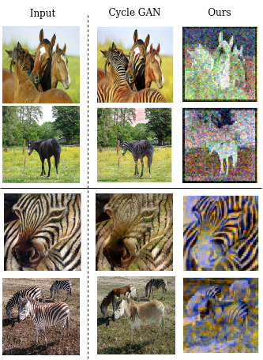

# Unpaired-via-SDE

We implement a Score-based Generative Model to perform unpaired image-to-image translations from an image domain A to an image domain B and vice versa. 
Domain A consists of satellite images. Domain B consists of the corresponding maps style images. 

### Results:
|1st column: Input Images / 2nd column: Domain Tranlated(CycleGANs) / 3rd column: Domain Translated(Ours)|
|:---:|
||

From the above image, we observe that our model needs further improvements to perform the unpaired image-to-image translation task. This is the subject of our future work. 

### Dataset
The model was trained on the horse2zebra dataset [link](http://efrosgans.eecs.berkeley.edu/cyclegan/datasets/).

### Training
To set the parameters edit the config.py file and then run the code as given in the main.ipynb notebook file.
